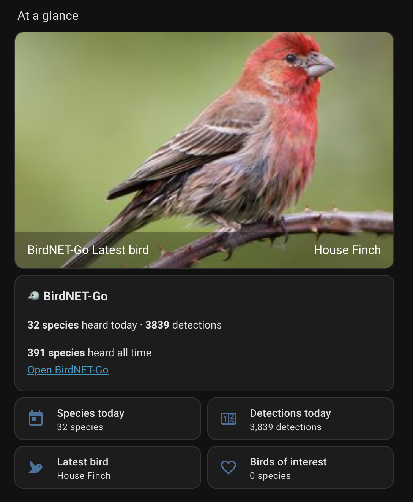
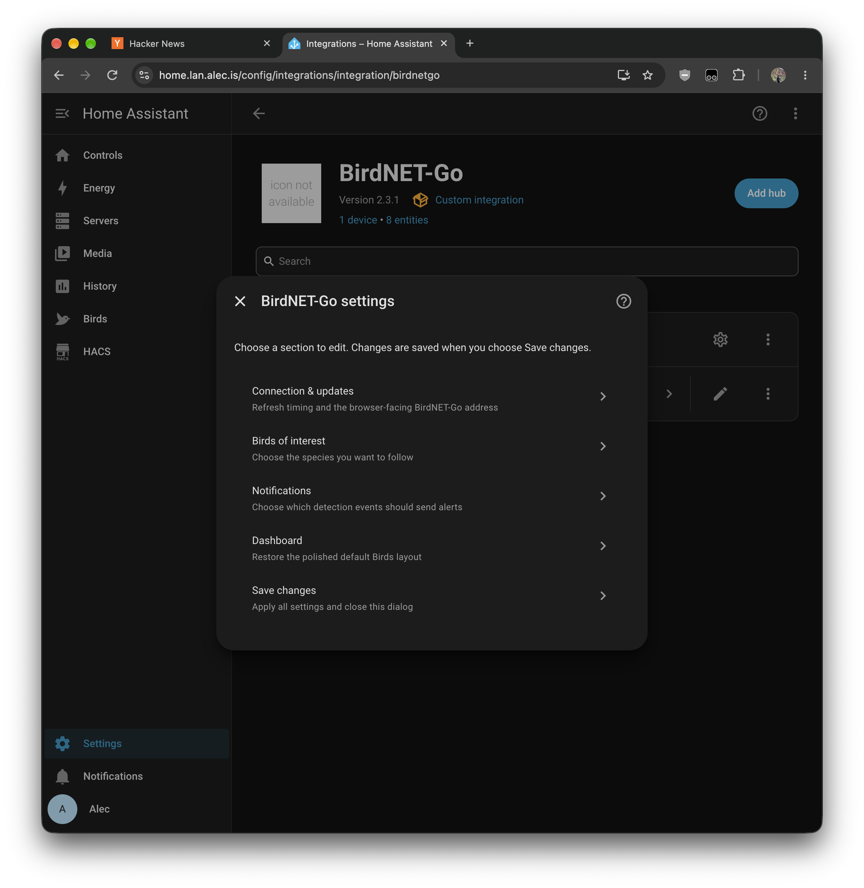
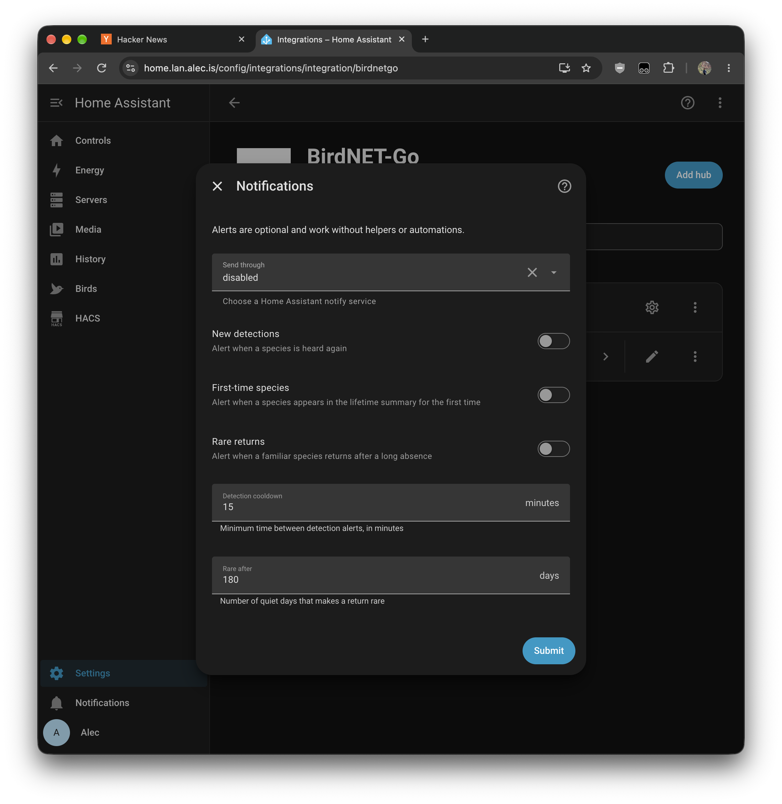

# BirdNET-Go for Home Assistant

Home Assistant integration for [BirdNET-Go](https://github.com/tphakala/birdnet-go). It reads the analytics API and adds sensors, an editable Birds dashboard, and optional notifications. Requires BirdNET-Go nightly-20250427 or newer.

## Screenshots

| Configure the integration | Optional detection alerts |
| --- | --- |
|  |  |

## Install

Add this repository as a HACS custom repository (category **Integration**), install BirdNET-Go, and restart Home Assistant. Or copy `custom_components/birdnetgo/` to your Home Assistant `config/custom_components/` directory and restart.

In **Settings > Devices & services > Add integration**, select BirdNET-Go and enter its address. The default polling interval is 60 seconds. Use **Configure** later to set birds of interest, notification service and alerts, or a separate browser-facing URL.

## Sensors

| Sensor | State |
| --- | --- |
| `sensor.birdnet_latest_bird` | Common name of the most recently heard species |
| `sensor.birdnet_detections_today` | Total detections today |
| `sensor.birdnet_daily_summary` | Unique species today |
| `sensor.birdnet_lifetime_species` | Unique species heard all time |
| `sensor.birdnet_latest_interest` | Most recently heard configured bird of interest |
| `sensor.birdnet_birds_of_interest` | Configured species heard all time |
| `sensor.birdnet_species_summary` | Timestamp of the latest detection |
| `camera.birdnet_latest_bird_image` | BirdNET-Go species image of the latest bird |

The name sensors also expose `last_heard` and `species_code` attributes (the latest bird also includes `scientific_name`). The summary sensors expose `species_list` for dashboard cards and automations. Home Assistant may assign different entity IDs if those names are already in use.

The dashboard is created automatically and can be edited. To restore its default layout, use **Configure > Dashboard > Restore the default layout** (this overwrites your edits).

The analytics API returns species summaries, not individual detection events. The latest bird is the species with the newest `last_heard` timestamp; polls can miss intermediate observations. Notification alerts are optional and may arrive up to one polling interval late. For per-detection camera and confidence data, see [webhook automations](docs/advanced-automations.md).

Large `species_list` attributes can generate substantial recorder history. If needed, exclude the three summary sensors from recorder; the compact sensors above can remain in history. See [custom dashboard examples](docs/advanced-dashboards.md) and [video scripts](scripts/).

Based on [Kyle Niewiada's BirdNET-Go guide](https://www.kyleniewiada.org/blog/2025/05/backyard-bird-tracking-with-ai). [MIT license](LICENSE).
